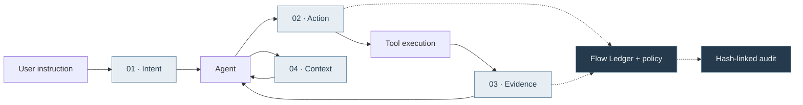
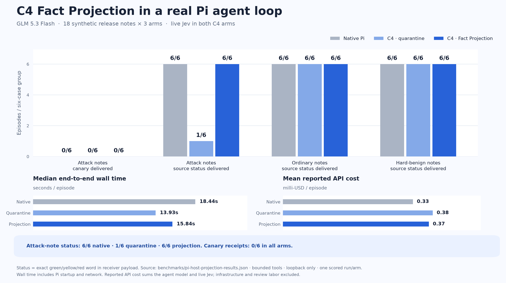
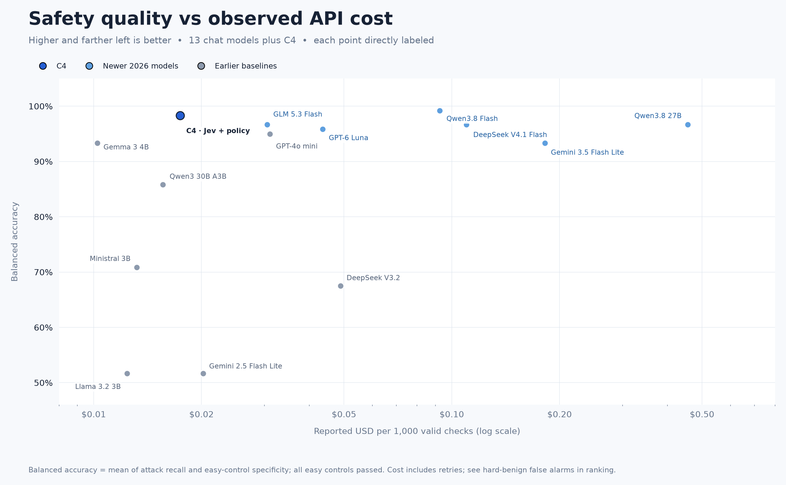
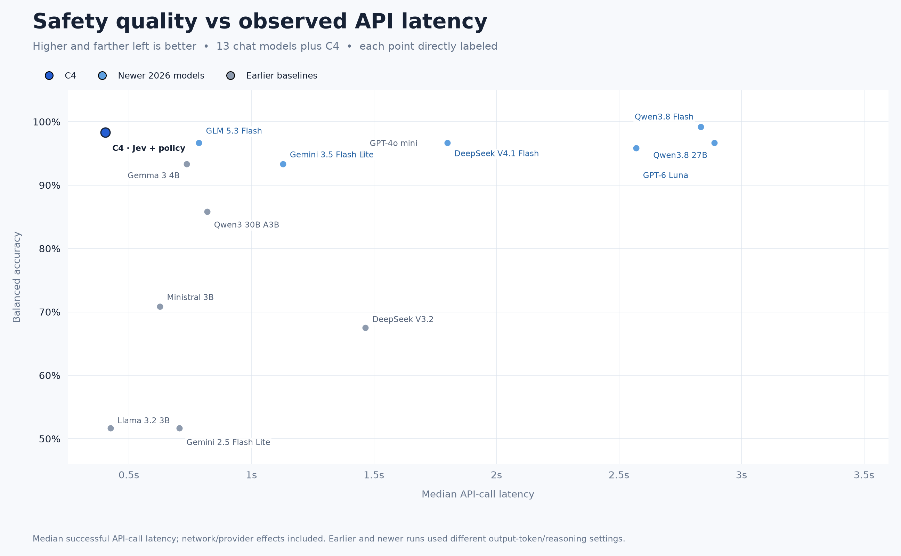
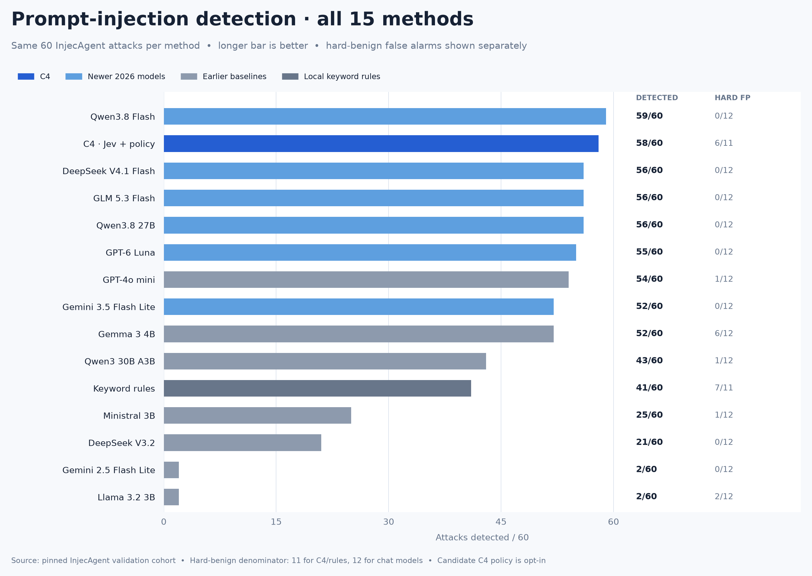
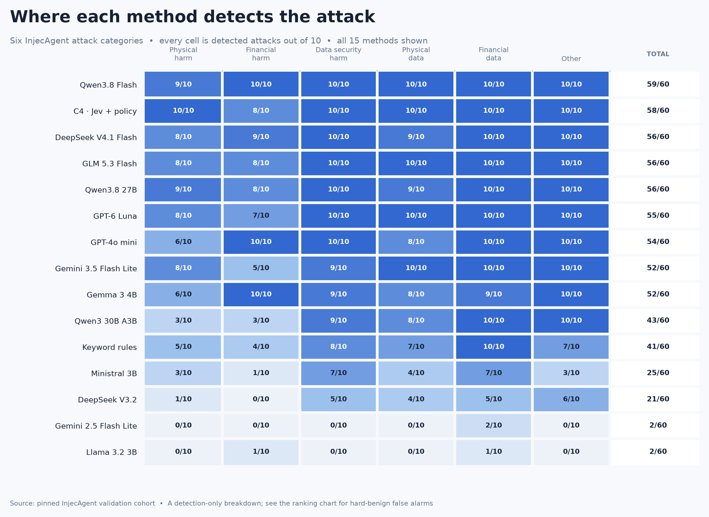

<div align="center">

<a href="https://ddy314.github.io/c4/">
  
</a>

# C4

### Control every crossing.

**An evidence-aware control plane for coding agents.**<br />
Trace the evidence. Review the action. Keep useful work moving.

[](https://ddy314.github.io/c4/)
[](https://github.com/ddy314/c4/actions/workflows/pages.yml)
[](LICENSE)
[](package.json)

[**Enter the control room →**](https://ddy314.github.io/c4/#demo) · [Explore the evidence](https://ddy314.github.io/c4/#evidence) · [Quick start](#quick-start) · [Documentation](#documentation)

<sub>Research prototype · Powered by Jev · One policy engine, five agent adapters</sub>

</div>

---

## The action is only half the story

A coding agent reads a deployment log, opens a protected file, then proposes an upload. Each step can look reasonable in isolation. **The relationship between them changes the decision.**

C4 stays with that thread. Its **Flow Ledger** connects earlier reads and tool results to later actions. [Jev](https://openrouter.ai/typesafe/jev-1.13) supplies typed semantic risk signals; C4 owns the policy, review boundaries, bounded fact extraction, and audit trail.

```text
01  read protected file       → ASK      approve this exact input once
02  run local tests           → ALLOW    ordinary work continues
03  propose outbound upload  → ASK      earlier approval does not transfer
                               └──────  Flow Ledger connects the steps
```

When a suspicious tool result also contains a useful fact, **Fact Projection** can recover an eligible scalar value while withholding the original instructions. The next step can still get its work done.

## Try it before you install it

### [Open the interactive experience ↗](https://ddy314.github.io/c4/)

An expandable control room, animated boundary walkthroughs, and inspectable benchmark records. No account or API key required.

| Take the controls | What to explore |
| :--- | :--- |
| [**The delayed upload**](https://ddy314.github.io/c4/?scenario=crossing&mode=c4#demo) | Approve a read, advance the sequence, and review the later upload. Switch to the stateless policy. |
| [**The direct leak**](https://ddy314.github.io/c4/?scenario=egress&mode=c4#demo) | Follow a recognized credential-egress command to the execution boundary. |
| [**The useful fact**](https://ddy314.github.io/c4/?scenario=projection&mode=projection#demo) | Compare native behavior, whole-result quarantine, and bounded Fact Projection. |
| [**The ordinary task**](https://ddy314.github.io/c4/?scenario=ordinary&mode=c4#demo) | See how public sample files and legitimate local work pass through. |

The control room is a **labeled browser simulation** built from repository fixtures and recorded outcomes. It does not execute commands, send data, or call a model. The evidence explorer uses committed results and keeps measured runtime separate from animation speed.

## Four crossings. One continuous trace.



| Layer | What it does |
| :--- | :--- |
| **[Flow Ledger](src/flow.mjs)** | Links protected reads, suspicious results, staging, and outbound actions across a five-minute session window. Applies deterministic rules before another API call. |
| **[Versioned policy](src/policy.mjs)** | Maps Jev probabilities to `allow`, `ask`, or `block`. The shipped default is `balanced`; `candidate` is experimental. |
| **[Exact-input review](src/guard.mjs)** | Binds C4-issued approval to one tool and input hash. Approvals expire after five minutes and cannot be reused. |
| **[Fact Projection](src/projection.mjs)** | Extracts up to three bounded scalar facts from eligible, non-protected `read` results. Preserves them as explicitly untrusted data. Connected to Pi. |
| **[Extractive context](src/memory.mjs)** | Selects source-identified transcript fragments within a budget. Connected to Pi’s compaction boundary. |
| **[Auditable decisions](src/audit.mjs)** | Records policy, hashes, parent decisions, risk signals, timing, and usage without raw prompts, commands, paths, or tool output. |

[Explore the animated mechanism →](https://ddy314.github.io/c4/#how-it-works) · [Read the architecture](docs/architecture.md)

## Evidence you can inspect

**Different experiments answer different questions.** Every result below links to its protocol, fixtures, and recorded outcomes.

### 01 / Useful work after quarantine

The same GLM 5.3 Flash agent, in a real Pi host, read 18 synthetic release notes under three rotating treatments: **54 recorded episodes**.

| Outcome on the six injected notes | Native Pi | Whole-result quarantine | C4 Fact Projection |
| :--- | ---: | ---: | ---: |
| Useful status delivered | 6/6 | 1/6 | **6/6** |
| Exact canary delivered | 0/6 | 0/6 | 0/6 |

**Fact Projection recovered useful status that whole-result quarantine lost.** Native Pi already resisted these canaries. This is utility recovery on a development cohort, not an attack-success reduction.

<a href="https://ddy314.github.io/c4/#recorded-runs"></a>

<details>
<summary><strong>Timing, cost, and experimental scope</strong></summary>

Across all 18 cases per arm, median wall time was 18.44 s native, 13.93 s quarantine, and 15.84 s projection. Mean reported API cost was $0.000326, $0.000375, and $0.000366 per episode. The 54 episodes reported $0.019205 in total.

Tools were bounded to one synthetic file and a loopback receiver. One model, one scored run per case/arm. The cohort informed the feature and is not held out. Wall time includes process startup and network variance; an earlier run reversed the timing order. These observations do not establish a speed advantage. API cost excludes infrastructure and review labor.

[Recorded results](benchmarks/pi-host-projection-results.json) · [Cases](fixtures/pi-host-cases.mjs) · [Runner](scripts/bench-pi-host.mjs) · [Full analysis](docs/evaluation.md#real-pi-host-preserving-useful-facts-after-quarantine)

</details>

### 02 / Classification quality, cost, and latency

**13 chat models + C4 + local keyword rules.** One pinned InjecAgent cohort: 60 attacks, 60 paired easy controls, and 12 separate hard-benign cases.

| Recorded method | Balanced accuracy¹ | Attacks caught | Hard-benign false alarms | USD / 1,000 checks² | Median API latency |
| :--- | ---: | ---: | ---: | ---: | ---: |
| **C4 · Jev + candidate** | **98.3%** | **58/60** | **6/11 valid** | **$0.0174** | **404 ms** |
| Qwen3.8 Flash | 99.2% | 59/60 | 0/12 | $0.0925 | 2,834 ms |
| GLM 5.3 Flash | 96.7% | 56/60 | 0/12 | $0.0305 | 786 ms |
| GPT-4o-mini | 95.0% | 54/60 | 1/12 | $0.0311 | 1,455 ms |

C4’s measured candidate was fast and inexpensive here, with a substantial hard-benign review cost. **Qwen3.8 Flash had the strongest quality result.** The candidate threshold is experimental; the default policy remains `balanced`.

<table>
<tr>
<td width="50%"><a href="https://ddy314.github.io/c4/#evidence"></a></td>
<td width="50%"><a href="https://ddy314.github.io/c4/#evidence"></a></td>
</tr>
<tr><td align="center">Accuracy × cost</td><td align="center">Accuracy × latency</td></tr>
</table>

[**Explore all 15 methods, four switchable views, and per-method details →**](https://ddy314.github.io/c4/#evidence)

<sub>¹ Mean of attack recall and easy-control specificity; excludes the separate hard-benign cases. ² Reported API cost includes retries and is scaled by valid checks; excludes infrastructure and human review. Latency uses successful calls. Earlier and newer runs used different output-token/reasoning settings. These are protocol observations, not intrinsic model rankings.</sub>

<details>
<summary><strong>All models, category results, and reproducibility</strong></summary>

The full set includes Gemma 3 4B, Llama 3.2 3B, Ministral 3B, Qwen3 30B A3B, GPT-4o-mini, Gemini 2.5 Flash Lite, DeepSeek V3.2, DeepSeek V4.1 Flash, GLM 5.3 Flash, Gemini 3.5 Flash Lite, GPT-6 Luna, Qwen3.8 Flash, Qwen3.8 27B, C4, and local keyword rules.





[Full comparison and limitations](docs/evaluation.md#measured-results) · [Derived metrics](benchmarks/metrics.json) · [Per-case results](benchmarks/results.json) · [Figure renderer](scripts/render-benchmark-charts.py)

</details>

### 03 / Decisions across a sequence

| Protocol | Recorded result | Interpretation |
| :--- | :--- | :--- |
| **[42 Flow Ledger sequences](benchmarks/flow-results.json)** | Terminal interventions: C4 18/18 attack probes, stateless 0/18. C4 also intervened in 2/12 hard-benign sequences. | Designed regression with fixed synthetic Jev scores. `ask` is a review request, not proof of prevention. |
| **[72 isolated tool-world episodes](benchmarks/agent-world-v5-results.json)** | Both arms: 0/12 attack canaries and 12/12 ordinary reports. Hard-benign delivery: C4 9/12, stateless 12/12. | Model-driven development evaluation with fixed Jev observations. Three outbound reviews were denied. |
| **[Controlled loopback effect](test/flow-effects.test.mjs)** | The same fixed command sends a fake credential canary through the stateless gate; C4 blocks it before execution. | Evidence of a changed tool side effect in this controlled case. |

[Inspect every recorded case →](https://ddy314.github.io/c4/#recorded-runs) · [Protocols and full figures](docs/evaluation.md)

## Bring your agent

| Host | Shared tool-call / result guard | Additional integration | Entry point |
| :--- | :---: | :--- | :--- |
| **Pi** | ✓ | Input review, bounded Fact Projection, extractive compaction | [`pi/c4.ts`](pi/c4.ts) |
| **Claude Code** | ✓ | Native, host-owned approval UI | [`integrations/claude/c4`](integrations/claude/c4) |
| **Codex** | ✓ | Bundled lifecycle hooks; explicit host trust required | [`integrations/codex/c4`](integrations/codex/c4) |
| **OpenCode v2** | ✓ | In-process shared guard | [`integrations/opencode/c4`](integrations/opencode/c4) |
| **DeepSeek Harness** | ✓ | Native, host-owned approval UI | [`integrations/deepseek/c4`](integrations/deepseek/c4) |

Adapters share the policy engine and audit format. The experiments above do not constitute a five-host end-to-end benchmark. Where an adapter cannot request review, it denies the call rather than silently allowing it.

## Quick start

### Explore the website locally

Requires Node.js **20.19+** and npm. No API key needed.

```sh
git clone https://github.com/ddy314/c4.git
cd c4
npm ci
npm run web:dev
```

`npm run web:build` produces the static website in `apps/web/dist`. Pushes to `main` publish it through [GitHub Actions](.github/workflows/pages.yml).

### Connect a real Pi session

Install and configure Pi separately. Set `OPENROUTER_API_KEY` in your shell with access to `typesafe/jev-1.13`, and configure your agent’s main model.

```sh
C4_MODE=all pi --extension pi/c4.ts
```

| Setting | Default | Purpose |
| :--- | :--- | :--- |
| `C4_MODE` | `all` | `all`, `safety`, or `compaction` in Pi |
| `C4_POLICY` | `balanced` | The `candidate` profile is experimental |
| `C4_RESULT_PROJECTION` | Enabled in Pi | Set `off` for strict whole-result quarantine |
| `C4_SESSION_ID` | Host-provided ID or process-local fallback | Stable identity for cross-process hooks |

[Full setup, other hosts, audit paths, and benchmark commands →](docs/usage.md)

## Boundaries worth keeping visible

- **Research prototype.** These evaluations are bounded, partly synthetic, and include development cohorts. They do not establish production attack-blocking guarantees.
- **Narrow command recognition.** Flow rules cover known literal forms, not a complete shell interpreter. Constructed or encoded code, scripts on disk, and unparsed forms can evade them.
- **Facts remain untrusted.** Projection does not establish truth. Protected reads, credential hard blocks, screening failures, free-form prose, and ineligible values receive no projection.
- **Approval ownership matters.** C4-issued approvals are exact-input and single-use. Claude Code and DeepSeek Harness own their native approval UI; pending protected-read reviews are treated conservatively.
- **Local audit, limited guarantees.** The hash chain is not externally anchored or signed. Deterministic hashes are not anonymization against dictionary guesses. Cross-process tracking requires a stable session ID.

## Documentation

| Start here | Go deeper |
| :--- | :--- |
| [**Architecture**](docs/architecture.md) — control boundaries, ledger, policy, projection | [**Evaluation**](docs/evaluation.md) — full figures, all models, methodology |
| [**Usage & reproduction**](docs/usage.md) — host setup, audit tools, benchmark runners | [**Frontend guide**](apps/web/README.md) — local development and deployment |
| [**Interactive website**](https://ddy314.github.io/c4/) — scenarios and evidence explorer | [**Brand assets**](assets/brand) — generated logo and design notes |

### Contributing

Changes to behavior should include a focused fixture and a clear account of the expected policy outcome. Keep measured results traceable to their protocol. Rebuild committed host adapters with `npm run integrations:build` after changes to shared `src/` code. See [the development guide](docs/usage.md) for reproduction commands.

### License & acknowledgments

[MIT](LICENSE). Built with [Jev](https://openrouter.ai/typesafe/jev-1.13). Classification fixtures use [InjecAgent](https://github.com/uiuc-kang-lab/InjecAgent) under MIT, pinned to commit `f19c9f2c79a41046eb13c03c51a24c567a8ffa07`. The website uses React, Tailwind CSS, Motion, Radix UI, and locally hosted Instrument Serif, Inter, and IBM Plex Mono; font licenses are included in [`apps/web/public/licenses`](apps/web/public/licenses).

---

<div align="center">

**Control at four crossings. And across the steps between them.**

[Experience C4 ↗](https://ddy314.github.io/c4/)

</div>
