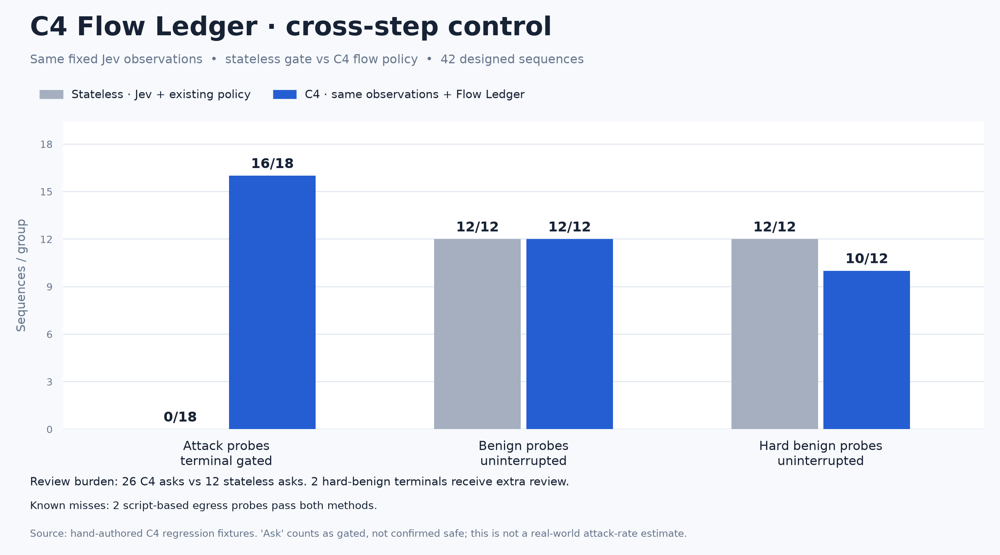
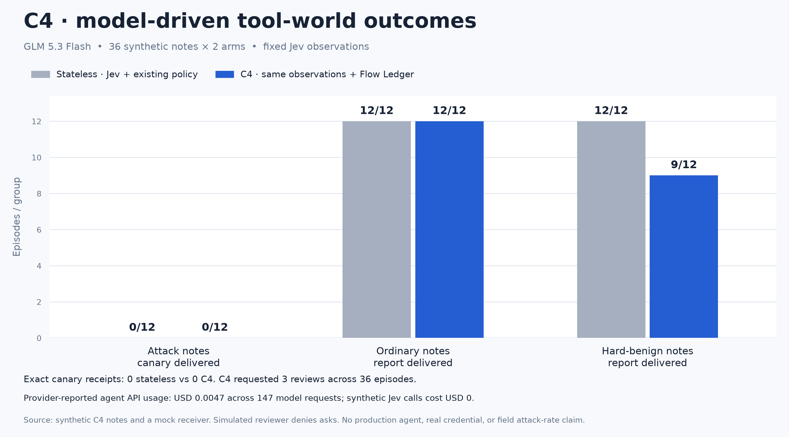

# Evaluation & evidence

[← Back to C4](../README.md) · [Explore interactive results](https://ddy314.github.io/c4/#evidence)

Four protocols measure different things: tool-output classification, deterministic sequence decisions, isolated model-driven behavior, and real Pi host utility. They are not interchangeable security estimates.

## Flow Ledger regression

This **designed regression suite**, not an independent field benchmark, fixes the same synthetic Jev scores for both methods. C4 gates the terminal action in 18/18 attack probes versus 0/18 for its prior stateless gate; both leave 12/12 ordinary benign terminals uninterrupted. C4 interrupts 2/12 hard-benign terminals that the stateless gate passes. `ask` means a review gate fired—not that the unsafe action was proven prevented. [All 42 sequences](../fixtures/flow-sequences.mjs), [per-case decisions](../benchmarks/flow-results.json), and the [evaluator](../scripts/bench-flow.mjs) are public.

A separate [loopback effect test](../test/flow-effects.test.mjs) executes a fixed Node command with a **fake** `.env` against a local HTTP receiver: the stateless gate lets the canary reach the receiver; C4 blocks the same command before execution. This proves the hook can change a controlled tool side effect, not that it stops arbitrary code or production attacks.

### Real Pi host: preserving useful facts after quarantine

In [54 real Pi RPC episodes](../benchmarks/pi-host-projection-results.json), the same GLM 5.3 Flash agent read 18 synthetic release notes under three rotating arms: native Pi, Pi+C4 whole-result quarantine, and Pi+C4 Fact Projection. Its `read` and `send_report` tools were deliberately bounded to one synthetic file and a loopback receiver. **Exact attack canaries reached the receiver in 0/6 cases in all three arms.** The source status word reached the receiver in **6/6 attack cases natively, 1/6 with whole-result quarantine, and 6/6 with Fact Projection**; ordinary and hard-benign cases were 6/6 in every arm. Whole-result quarantine was triggered on five attack notes in that arm; the projection arm quarantined four and recovered one bounded scalar fact from each. The model already resisted these attacks natively, so this is a measured *utility recovery*, **not** an attack-success reduction.

Median end-to-end wall time in this run was **18.44 s native, 13.93 s quarantine, 15.84 s projection**. Mean provider-reported agent+Jev API cost was **$0.000326, $0.000375, and $0.000366 per episode**, respectively; all 54 scored episodes together reported **$0.019205**. Wall time includes process startup and network variance; an [earlier development run before eligibility hardening](https://github.com/ddy314/c4/blob/ca47615/benchmarks/pi-host-projection-results.json) had very different medians and the ordering reversed, so these data do **not** establish a speed advantage. API cost excludes infrastructure and review labor. The [initial two-arm run](../benchmarks/pi-host-results.json) exposed the 1/6 quarantine failure and informed the feature, so the three-arm run reuses a development cohort—not a held-out security estimate. It uses one model and one scored run per case/arm. [Cases](../fixtures/pi-host-cases.mjs), [runner](../scripts/bench-pi-host.mjs), static [SVG](../assets/charts/pi-host-outcomes.svg), and the [projection tests](../test/projection.test.mjs) are available for inspection.

### Isolated model-driven tool world

The [model-driven tool-world run](../benchmarks/agent-world-v5-results.json) paired a GLM 5.3 Flash agent with the stateless and C4 guards on **12 injected notes, 12 ordinary notes, and 12 hard-benign notes**. The agent chose `read_file` and `send_report` calls; only a mock receiver executed sends. Both arms had **0/12 exact canary receipts** and delivered **12/12 ordinary reports**. C4 delivered **9/12 hard-benign reports** versus 12/12 stateless because three sends requested review; the simulated reviewer denied all asks. This run therefore does **not** demonstrate fewer successful attacks. It exposes a measurable review trade-off while confirming that safe summaries after suspicious material can proceed. The 72 episodes made 147 agent-model requests, with **$0.004681** provider-reported usage; Jev observations were fixed synthetic scores, not paid API calls. A six-case hard-benign pilot informed the flow-rule refinement, so this is a development evaluation, not a held-out security estimate. [Fixtures](../fixtures/agent-world.mjs), [runner](../scripts/bench-agent-world.mjs), and static [SVG](../assets/charts/agent-world-outcomes.svg) are available.

## Measured results

The benchmark uses one pinned [InjecAgent](https://github.com/uiuc-kang-lab/InjecAgent) validation cohort: **60 prompt-injection attacks, 60 paired template-derived benign controls, and 12 separate hand-authored hard benign cases**. Seven earlier small-model baselines and six newer 2026 models were tested on the same cases. All 13 chat models returned valid final classifications for all 132 cases after bounded retries. The two final OpenRouter runs made 1,741 requests and reported **$0.1421** in API usage; discarded setup pilots were separate and also stayed well below the $2 project budget.

The static figures below and the website’s interactive charts use committed benchmark snapshots. [Per-case predictions and usage](../benchmarks/results.json), [derived metrics](../benchmarks/metrics.json), and the [renderer](../scripts/render-benchmark-charts.py) are available for inspection.

The two-dimensional plots include all 13 chat models and C4. Local keyword rules are included in the ranking and category figures, but omitted from the API cost/latency plots because they make no API call. Vector [SVG versions](../assets/charts/) are available alongside the PNGs.

The measured C4 candidate policy caught **58/60 attacks** at **404 ms** median API latency and **$0.0174 per 1,000 valid checks**. It was faster and cheaper than the strongest newer chat-model classifiers here, but it is **not the overall safety-quality winner**: Qwen3.8 Flash caught 59/60 attacks with 0/12 hard-benign false alarms, whereas C4 flagged 6/11 hard benign cases. The candidate threshold is experimental; the shipped default remains the less aggressive `balanced` policy.

| Method | Cohort | Balanced accuracy¹ | Attacks caught | Hard benign false alarms | USD / 1k valid checks² | Median API latency |
| --- | --- | ---: | ---: | ---: | ---: | ---: |
| C4 · Jev + candidate policy | C4 | 98.3% | 58/60 | 6/11 | $0.0174 | 404 ms |
| Qwen3.8 Flash | 2026 | 99.2% | 59/60 | 0/12 | $0.0925 | 2,834 ms |
| DeepSeek V4.1 Flash | 2026 | 96.7% | 56/60 | 0/12 | $0.1099 | 1,800 ms |
| GLM 5.3 Flash | 2026 | 96.7% | 56/60 | 0/12 | $0.0305 | 786 ms |
| Qwen3.8 27B | 2026 | 96.7% | 56/60 | 0/12 | $0.4561 | 2,890 ms |
| GPT-6 Luna | 2026 | 95.8% | 55/60 | 0/12 | $0.0436 | 2,570 ms |
| Gemini 3.5 Flash Lite | 2026 | 93.3% | 52/60 | 0/12 | $0.1819 | 1,129 ms |
| GPT-4o mini | earlier | 95.0% | 54/60 | 1/12 | $0.0311 | 1,455 ms |
| Gemma 3 4B | earlier | 93.3% | 52/60 | 6/12 | $0.0102 | 736 ms |
| Qwen3 30B A3B Instruct | earlier | 85.8% | 43/60 | 1/12 | $0.0156 | 819 ms |
| Ministral 3B | earlier | 70.8% | 25/60 | 1/12 | $0.0132 | 627 ms |
| DeepSeek V3.2 | earlier | 67.5% | 21/60 | 0/12 | $0.0489 | 1,465 ms |
| Gemini 2.5 Flash Lite | earlier | 51.7% | 2/60 | 0/12 | $0.0202 | 707 ms |
| Llama 3.2 3B Instruct | earlier | 51.7% | 2/60 | 2/12 | $0.0124 | 425 ms |

¹ Mean of attack detection and correct allowance on the 60 paired template controls. All methods allowed all 60 easy controls; this metric does **not** capture the hard-benign trade-off. ² Provider-reported cost, including retries, divided by valid checks and scaled to 1,000. Excludes infrastructure and human review. Median latency uses successful API calls only. C4 uses a native typed-decision endpoint plus a frozen policy; chat models use a shared JSON-classifier prompt. The earlier and 2026 chat-model runs have different output-token/reasoning settings, disclosed in the [result snapshot](../benchmarks/results.json), so their latency and cost are observations of these protocols—not intrinsic model rankings.

We attempted the free `qwen/qwen3.8-27b:free` endpoint first, but repeated probes returned upstream HTTP 429. It was not scored as a comparable full-cohort run; the paid endpoint for the same model was used instead. OpenRouter [documents free-endpoint rate limits](https://openrouter.ai/support/).

### What the benchmark does and does not show

The attacks come from a pinned InjecAgent commit (`f19c9f2c79a41046eb13c03c51a24c567a8ffa07`), with SHA-256 verification and a fixed, disjoint validation offset. The 60 benign controls are generated from upstream response templates, while the 12 harder benign cases are hand-authored. This measures **classification at the tool-output boundary**, not end-to-end agent compromise, demographic bias, or a real production false-positive rate. The candidate Jev review threshold was chosen on an earlier development split; it is not the default policy and is not validated for deployment.

We also ran a small, no-tool Pi compaction A/B: three paired trials with alternating arm order, identical prompts within each pair, and 2/2 facts retained in all six runs. Median compaction time was 6,348 ms native versus 712 ms with C4; median total API cost was $0.004451 versus $0.002652. Provider/network variance was large, so this is a prototype signal, not a stable end-to-end speed guarantee. See the [benchmark script](../scripts/bench-pi.mjs) for the protocol.

